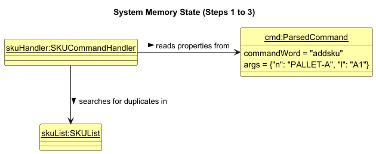
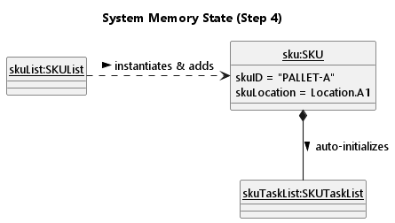
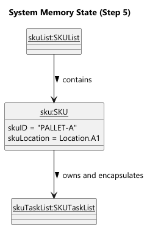
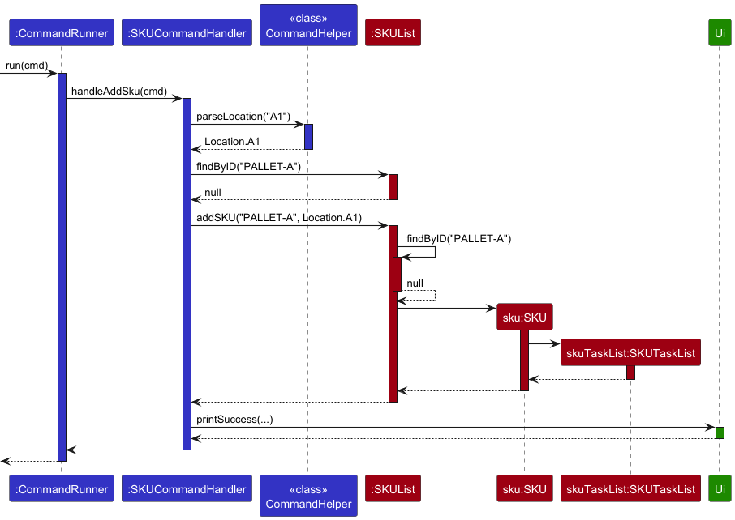

# Om Tirodkar - Project Portfolio Page

## Overview
ItemTasker is a CLI-based Stock Keeping Unit (SKU) Ticketing System. A localized command-line tool designed to handle inventory specific actions required for individual item SKUs such as damage checks, expiry reviews & quality control. 

## Summary of Contributions

### Code Contributed
[RepoSense link of my profile.](https://nus-cs2113-ay2526-s2.github.io/tp-dashboard/?search=omcodedthis&breakdown=true)

## Enhancements Implemented

### Add / Delete SKU
* **Objective & Complexity:** Established core inventory management by designing `SKUList` to add/delete SKUs and their encapsulated `SKUTaskList`s. Required validating `Location` enums, and safely modifying the underlying `ArrayList` to ensure memory-safe list management.
* **Completeness & Difficulty:** (Moderate) Robustly prevents duplicate entry bugs via case-insensitive ID matching and rejects invalid inputs (null/empty IDs), validated by comprehensive unit tests.

### Export
* **Objective & Complexity:** Compiled the warehouse state into a human-readable text file for auditing. Required dynamic string formatting and safe local file system interaction that is OS-agnostic.
* **Completeness & Difficulty:** (High) Ensured OS-agnostic reliability by defensively checking edge-case file states (e.g., existing "Data" files blocking directory creation via `IOException`). Automatically generates directories, handles empty states, and ensures I/O streams close safely.

### Command Object Instantiation
* **Objective & Complexity:** Decoupled raw CLI input from application logic by reliably isolating command words and optional flag-value pairs (e.g., `n/`, `p/`) into a structured, easily queryable `ParsedCommand` object.
* **Completeness & Difficulty:** (Moderate) Takes unpredictable inputs (handling whitespaces/empty strings) and normalizes keys. Used a `Collections.unmodifiableMap` to strictly enforce immutability and a read-only dataset, preventing downstream handlers from mutating arguments.

### Entry-Loop, Exceptions & Testing
* **Objective & Complexity:** Designed the `while (runner.isRunning())` loop in `ItemTasker.java` and established an exception hierarchy (inheriting from `ItemTaskerException`) to handle invalid inputs.
* **Completeness & Difficulty:** (Moderate) Architected a clean separation of concerns where the Controller (`CommandRunner`) throws domain-specific exceptions, caught at the top level to translate nested errors into user-friendly UI messages without leaking stack traces. This enabled extensive foundational unit testing (68.6% coverage).

### Contributions to the User Guide (UG)

### FAQ Section
Authored FAQ section Q&A segments on saving, data-transfer and on implementation, translating into actionable steps for both technical and non-technical users alike.

### Contributions to the Developer Guide (DG)

### SKU Component
Created all the UML diagrams and explanation for the SKU component, under Design.

### Storage Component
Created all the UML diagrams and explanation for the Storage component, under Design.

### Add / Delete SKU Enhancement
Created all the UML diagrams and explanation for the Add / Delete enhancement, under Implementation.

### Appendix
Wrote the:
1. **Appendix A: Product Scope**
2. **Appendix D: Glossary**
3. **Appendix E: Manual Testing**

sections to cater to both technical and non-technical audiences alike.

### Contributions to Team-Based Tasks
1. **Repository Setup & Organization:** I established the initial GitHub organization and repository infrastructure for the team, configuring access controls, branch protection rules, and team onboarding to ensure a secure and collaborative development environment.
2. **Release Management:** Tagged, and deployed major application versions of v1.0 and v2.0 milestone releases.
3. **Workflow Standardization & Issue Tracking:** Standardized our GitHub workflow. This included a custom issue template, adding labels to tag statuses of Tasks and Bugs correctly.
4. **Documentation Coordination:** Coordinated and drafted the non-feature-specific sections of our project documentation via Google Docs, inclusive of setting up the user stores page. This also included tracking of target user profile, outlining the product scope, and ensuring a consistent tone across the manuals.
5. **Project Management & Task Delegation:** Facilitated feature discussions, guiding the team toward consensus on the final product scope. Furthermore, this involved managing project timelines, incorporating buffer periods to mitigate the impact of unforeseen isses.

### Review and Mentoring Contributions
Faciliated and provided suggestions for better, more cohesive architecture, and the delegation of tasks to match member's strengths and preferences, through the use of a [central Google Docs](https://docs.google.com/document/d/e/2PACX-1vQohHhSMz69R5UO6f5hfYUJkco6Apk47ItuhdlcX0ttFVttmwhCqM7oTatOpOYOT16jKZL-DuIsKyZv/pub) file to keep track of tasks and scope.

### Contributions Beyond the Project Team
To be added.

### Contributions to the Developer Guide (Extracts)
Below is an extract of the **Add / Delete SKU Section** from Implementation:

### Add / Delete SKU Feature

#### Implementation Details
The Add and Delete SKU mechanism is facilitated by the `SKUCommandHandler` component, which is dispatched by the `CommandRunner`. It manages the application's core state through a single primary data structure: the `SKUList`. Following object-oriented encapsulation principles, there are no external maps; each `SKU` manages its own `SKUTaskList`.

The operations are exposed and handled internally via the following methods:

* `SKUCommandHandler#handleAddSku(ParsedCommand)` — Validates arguments (ensuring they are not null or empty), checks for duplicates, and delegates to `SKUList` to instantiate a new `SKU` (which automatically initializes its own internal task list).
* `SKUCommandHandler#handleDeleteSku(ParsedCommand)` — Validates the input, ensures the target SKU exists, and removes the `SKU` from the inventory, which deletes purges all tasks associated with it.

Given below is an example usage scenario demonstrating how the Add SKU mechanism behaves at each step.

**Step 1.** The user executes `addsku n/PALLET-A l/A1`. The `Ui` reads the input, and the `Parser` extracts the command word and maps the arguments `n/` to `PALLET-A` and `l/` to `A1` into a `ParsedCommand` object.

**Step 2.** The `CommandRunner#run()` method receives this `ParsedCommand`. Recognizing the `addsku` command word, it routes execution to the dedicated `SKUCommandHandler#handleAddSku()`.

**Step 3.** `handleAddSku()` performs validations, checking for missing or empty arguments. It calls `CommandHelper.parseLocation("A1")` to resolve the `Location` enum. It then calls `skuList.findByID("PALLET-A")` to iterate through the `SKUList`. If no duplicates are found, it proceeds with the insertion.

**Step 4.** The `SKUList#addSKU()` method is invoked. This method acts as a secondary defensive barrier, checking inputs before calling the `SKU` constructor. During instantiation, the `SKU` normalizes its ID (trimming whitespace and forcing uppercase) and automatically generates an empty `SKUTaskList` for itself. The `SKU` is then appended to the internal `ArrayList`.

**Step 5.** Back in `handleAddSku()`, execution completes successfully. Control returns to the `Ui` to print the success message. The system's memory state now contains the new `SKU`, fully equipped to accept tasks without requiring any external mapping.

*Note: The `deletesku` command operates by routing to `SKUCommandHandler#handleDeleteSku()`, which validates the input and throws a `SKUNotFoundException` if the target does not exist. It then calls `SKUList#deleteSKU()` to perform a case-insensitive removal from the array. Due to encapsulation, dropping the `SKU` object automatically garbage-collects its associated `SKUTaskList`, preventing memory leaks.*

The following sequence diagram shows the flow of adding a SKU:

The following class diagram shows the architecture:

#### Design Considerations

**Aspect: How SKU tasks are stored and mapped to their parent SKU:**

* **Current Implementation:** Require all task operations to access the `SKUTaskList` directly through the `SKU` object residing in the `SKUList`.
    * *Pros:* High cohesion and strict encapsulation. A SKU is solely responsible for its own tasks. Memory overhead is reduced, and state mutations are safer as there is no need to synchronize deletions across multiple data structures.
    * *Cons:* Slightly slower lookup times, as finding a task requires iterating through the `SKUList` to locate the parent SKU first (O(n) complexity).
* **Alternative:** Maintain a `HashMap<String, SKUTaskList>` inside the command handlers or `CommandRunner` to map SKU IDs to their tasks.
    * *Pros:* Fast, O(1) time complexity when looking up tasks for a specific SKU during filtering or task addition.
    * *Cons:* Severe data duplication and poor encapsulation. This requires the handlers to juggle references and manually synchronize deletions across two separate data structures, leading to an architecture prone to orphaned tasks if not correctly synced.

## Contributions to the User Guide (Extracts)
Below is an extract of the **FAQ Section**:
**Q**: How do I transfer my warehouse data to another computer?  
**A**: Install the application on the other computer and run it once to generate the default folders. Then, simply overwrite the `Data/storage.json` file it creates with the `storage.json` file from your previous computer.

**Q**: Do I need to manually save my tasks before closing the application?  
**A**: No. ItemTasker automatically saves your entire inventory and task list to the hard disk whenever you close the application using the `bye` or `exit` commands. Just ensure you exit the app properly instead of force-closing the terminal!

**Q**: Can I use my own custom location names like "Loading-Dock" or "Aisle-12"?  
**A**: Currently, ItemTasker strictly uses a standardized 3x3 grid system (A1 through C3) to ensure spatial sorting and distance calculations work instantly. You must assign SKUs to one of the 9 predefined sectors.

**Q**: How does the `listtasks l/LOCATION` command calculate distance?  
**A**: It calculates the "Manhattan Distance" across the warehouse grid. It measures the physical grid steps required to move from your specified location to the SKU's location, bringing the closest tasks to the top of your list so you can clear them efficiently.

**Q**: What happens if I manually edit the `storage.json` file and make a mistake?  
**A**: If the JSON format becomes invalid, outdated, or corrupted due to manual edits, ItemTasker will print a warning on startup and begin with an empty warehouse to prevent system crashes. It is highly recommended to make a copy of your `storage.json` file before doing any manual tweaking.